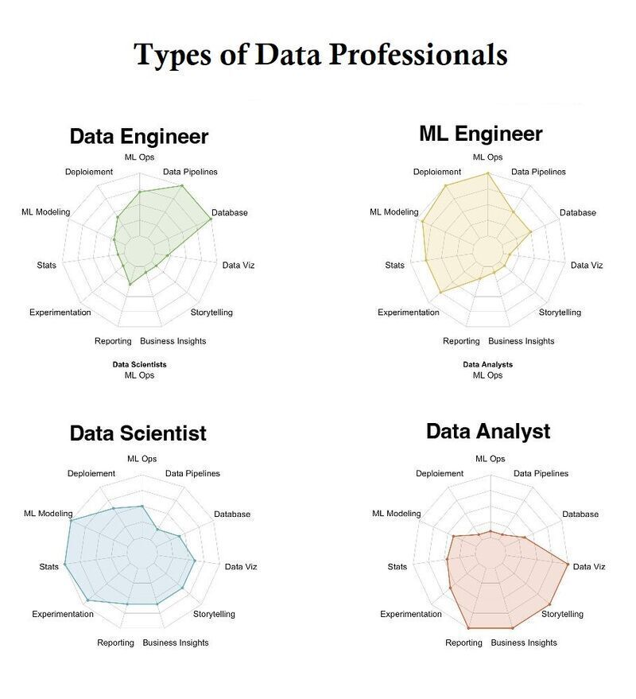

# Software Engineering in Practice

# Machine Learning & MLOps Lab

Apostolis Garos (apostolisgaros@gmail.com)

Ilias Balampanis (ibalampanis@aueb.gr)

---

<!-- paginate: true -->

# Machine Learning and MLOps Lab

### 🎯 Goals

By the end of this lecture, you'll gain insights into:

-   🔄 **ML Basic Workflow:** Understanding the steps of a ML model development
-   🚀 **MLOps Introduction:** Discovering how ML models transition from development to production

---

# Agenda

1. **Introduction to Machine Learning** 💡
2. Basic ML Workflow
3. Types of Machine Learning
4. Introduction to MLOps
5. Practical Demonstration

---

# Why Machine Learning Matters

-   **Efficiency and Automation:** Automate human-like tasks such as speech recognition and decision making.
-   **Data Insights:** Unlock insights from data, leading to informed decisions quickly.
-   **Innovation:** New products, services, and technology engagement methods.

\
What are some real-world applications of machine learning?

---

# Machine Learning in Entertainment🍿

-   **Application:** Personalizing content recommendations.
-   **Example:** Netflix
-   **Usage:** ML-powered algorithms tailor content to user preferences, enhancing viewer satisfaction and engagement.
-   **Impact:** Netflix’s recommendation system is estimated to save **$1 billion per year** by reducing churn.

---

# Machine Learning in Programming👩🏻‍💻

-   **Application:** AI Pair Programmer
-   **Example:** GitHub Copilot
-   **Usage:** GitHub Copilot, auto-suggests code snippets and functions as you type, to enhance your productivity.
-   **Impact:** GitHub's research shows that developers using GitHub Copilot can finish tasks up to **55% faster**.

---

# Machine Learning Across Industries🌍

-   **Application:** Versatility in text generation for various tasks.
-   **Example:** ChatGPT by OpenAI
-   **Usage:** Assists in writing, coding, tutoring, and more, showcasing ML’s adaptability.
-   **Impact:** Game-changer for (almost) **anyone**.

---

# What is Machine Learning? 🤯

**Definition:** Machine Learning is a subset of artificial intelligence (AI) that provides systems the ability to automatically learn and improve from experience without being explicitly programmed.

---

# What is Machine Learning? 🤨

**Definition:** Machine Learning is a subset of artificial intelligence (AI) that provides systems the ability to **_automatically learn and improve from experience_** without being explicitly programmed.

---

# What is Machine Learning? 😅

**Definition:** Machine Learning is a subset of artificial intelligence (AI) that provides systems the ability to automatically learn and improve from experience **_without being explicitly programmed._**

---

# Interactive Exercise: Alien Gender Classification

-   **Task:** We'll look at sketches of aliens, labeled as male or female.
-   **Your Challenge:** Predict the gender of a new unlabeled alien.

---

# Interactive Exercise: Alien Gender Classification

---

# Interactive Exercise: Alien Gender Classification

---

# What is Machine Learning? 🚀

**Definition:** Machine Learning is a subset of artificial intelligence (AI) that provides systems the ability to automatically learn and improve from experience without being explicitly programmed.

---

# Agenda

1. Introduction to Machine Learning
2. **Basic ML Workflow** 💡
3. Types of Machine Learning
4. Introduction to MLOps
5. Practical Demonstration

---

# Basic Machine Learning Workflow

1. **Data Collection:** Gathering data.
2. **Data Preprocessing:** Cleaning and organizing data.
3. **Model Selection:** Choosing the right model.
4. **Training:** Using data to learn patterns.
5. **Evaluation:** Assessing performance.
6. **Iteration:** Refining for accuracy.

---

# The important part: DATA 📊

-   **Data Collection:** Foundation of ML. Quality and quantity are crucial.
-   **Preprocessing:** Cleaning, handling missing values, encoding, normalizing.

---

# The fun part: MODELS 🤖

-   **Model Selection:** From simple (linear regression) to complex models (neural networks), based on data and problem.
-   **Training:** Process of learning the data patterns.
-   **Evaluation:** Using accuracy or other metrics.

---

# Agenda

1. Introduction to Machine Learning
2. Basic ML Workflow
3. **Types of Machine Learning** 💡
4. Introduction to MLOps
5. Practical Demonstration

---

# Types of Machine Learning

-   **Supervised Learning:** Learning from labeled data (e.g., spam detection).
-   **Unsupervised Learning:** Finding patterns in unlabeled data (e.g., customer segmentation).
-   **Reinforcement Learning:** Making decisions from feedback (e.g., video game AI).

---

# Deep Dive: Supervised Learning

-   **Process:** Learning from input-output pairs and adjusting based on prediction accuracy.
-   **Applications:**
    -   📧 **Spam Detection:** Email platforms like Gmail use supervised learning to filter out unwanted emails.
    -   📊 **Sentiment Analysis:** Social media platforms analyze user comments to gauge public sentiment towards products or events.
    -   🏥 **Medical Diagnosis:** AI-driven tools assist doctors by providing more accurate diagnoses based on patient data.

---

# Deep Dive: Unsupervised Learning

-   **Process:** Discovering patterns and relationships in data without any labels.
-   **Applications:**
    -   🛍️ **Customer Segmentation:** Retailers use unsupervised learning to group customers based on purchasing behavior.
    -   🔍 **Anomaly Detection:** Credit card companies use it to identify unusual patterns that may indicate fraud.
    -   ▶️ **Content Recommendation:** YouTube utilizes unsupervised learning to cluster similar videos, enhancing video suggestions.

---

# Deep Dive: Reinforcement Learning

-   **Process:** Learns through trial and error, guided by rewards for correct actions and penalties for mistakes, aiming to achieve specific goals.
-   **Applications:**
    -   🎲 **Game Playing:** AlphaGo by DeepMind learned to win at Go by practicing thousands of games.
    -   🤖 **Robotics:** Boston Dynamics’ robots navigate and adapt to obstacles with reinforcement learning.
    -   🎵 **Personalized Recommendations:** Spotify personalizes playlists by learning from user feedback.

---

# Agenda

1. Introduction to Machine Learning
2. Basic ML Workflow
3. Types of Machine Learning
4. **Introduction to MLOps** 💡
5. Practical Demonstration

---

# Introduction to MLOps

-   **Definition:** MLOps (Machine Learning Operations) combines Machine Learning, DevOps, and Data Engineering to streamline and automate the ML model lifecycle.
-   **Goal:** Ensure that ML models are not just developed but also reliably deployed and maintained in production environments.

---

# Why MLOps Matters

-   **Speed and Efficiency:** Accelerates the transition from experimentation to production.
-   **Reproducibility:** Ensures models are traceable and results are repeatable.
-   **Scalability:** Facilitates the management of growing data and model complexity.

---

# Key Components of MLOps

1. **Data Management:** Ensuring data quality and accessibility.
2. **Model Training and Deployment:** Automating the integration, testing, releasing, and deployment of models.
3. **Monitoring and Maintenance:** Continuous monitoring of model performance and data drift, with provisions for easy updates.

---

# MLOps Tools and Technologies

-   **Workflow Orchestration:** Tools like Apache Airflow and Kubeflow automate and manage ML workflows.
-   **Model Serving:** TensorFlow Serving, TorchServe, and MLflow for deploying trained models into production.
-   **Monitoring:** Prometheus, Grafana, and custom metrics for tracking model performance and data quality.

---

# Practical Example of MLOps 🚀

**Enhancing music apps with AI-Driven Recommendations**

-   **Monitoring & Retraining:**

    -   **Automated Retraining:** Regular updates using new data keep the engine aligned with music trends and user preferences.

    -   **Deployment Automation:** Tools ensure smooth updates, giving listeners ever-fresh playlists.

    -   **Consistency Checks:** Post-update tests ensure recommendations always hit the mark.

---

# Agenda

1. Introduction to Machine Learning
2. Basic ML Workflow
3. Types of Machine Learning
4. Introduction to MLOps
5. **Practical Demonstration** 💡

---

# Practical Demonstration 👨‍💻

-   **Project:** Sentiment Analysis on IMDB Movie Reviews
-   **Overview:** Perform sentiment analysis on a dataset of 50,000 movie reviews from IMDB.
-   **Contents:** Jupyter notebook outlining the process from data collection to model evaluation and iteration.
-   **Github repo:** [IMDB Sentiment Analysis](https://github.com/garosap/imdb-sentiment-analysis)

---

# Exploring Data Careers: Who Does What?

- **Data Engineer:** Builds the data pipelines and architecture for ML deployment.

- **Machine Learning Engineer:** Develops and deploys ML models for production.

- **Data Scientist:** Analyzes data to discover insights and trends.

- **Data Analyst:** Interprets data to inform business decisions.

---

 

